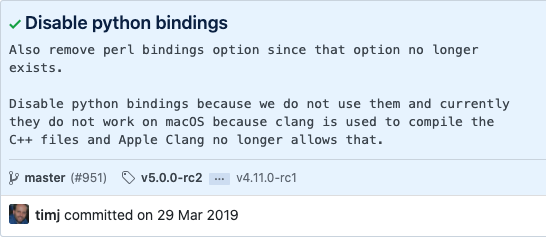

# Building XRootD with cmake and installing the source project

## System info:

* Developer tools:

```python
  Version:	11.4.1 (11E503a)
  Location:	/Applications/Xcode.app
  Applications:
  Xcode:	11.4.1 (16137)
  Instruments:	11.4.1 (64535.74)

```

* Hardware overview
  
```python
  Model Name:	MacBook Pro
  Model Identifier:	MacBookPro16,1
  Processor Name:	8-Core Intel Core i9
  Processor Speed:	2,4 GHz
  Number of Processors:	1
  Total Number of Cores:	8
  L2 Cache (per Core):	256 KB
  L3 Cache:	16 MB
  Hyper-Threading Technology:	Enabled
  Memory:	32 GB
  Boot ROM Version:	1037.80.53.0.0 (iBridge: 17.16.13050.0.0,0)
  Serial Number (system):	-
  Hardware UUID:	-
  Activation Lock Status:	Enabled
```

* Software

```txt
  System Version:	macOS 10.15.3 (19D76)
  Kernel Version:	Darwin 19.3.0
  Boot Volume:	Macintosh HD
  Boot Mode:	Normal
  Computer Name:	Robert's MacBook Pro
  Username:	Robert Poenaru (basavyr)
  Secure Virtual Memory:	Enabled
  System Integrity Protection:	Enabled
  Time since boot:	4 days 1:12
```

## Building the project

1. build with cmake, according to [this script](https://github.com/xrootd/xrootd/blob/b04fa906e5c1dd0278881c985b283330cc572a93/.gitlab-ci.yml#L265). (gitlab nightly build).
   1. use appropriate paths for `ZLIB`, `OPENSSL` (the include dir, the crypto library and the ssl library)
   2. build without `VOM` modules for macOS (use command: `-DVOMSXRD_SUBMODULE=OFF`)

### Missing `XrdVersion` header in `XrdSysPlugin.cc`+`XrdSysPlugin.hh`

In case of building errors with regards to missing the version info header:

```text
/Users/basavyr/Library/Mobile Documents/com~apple~CloudDocs/Work/Pipeline/DFCTI/CERN_project/0xrootd_project/xrootd/src/XrdSys/XrdSysPlugin.cc:91:42: error:
      member access into incomplete type 'XrdVersionInfo'
                                   myInfo->vStr, urInfo.vStr, mmv, majv, minv);
                                         ^
/Users/basavyr/Library/Mobile Documents/com~apple~CloudDocs/Work/Pipeline/DFCTI/CERN_project/0xrootd_project/xrootd/src/./XrdSys/XrdSysPlugin.hh:35:8: note:
      forward declaration of 'XrdVersionInfo'
struct XrdVersionInfo;
```

> The header file should be created by the `genversion.sh` script at compile time. If that isn't the case, then just run the script from the command line separately:

```bash
cd xrootd/
./genversion.sh
```

See the header file [here](../src/XrdVersion.hh)

> Working command for OSX Catalina (10.15.3) 

the command for building with cmake can be found [here](build_command_Catalina).

## Installing the source files

Once the building process with cmake completely finished, use `make install` for the installation process.

1. Installing the `Xrd` client sources:

```bash
    cd src/XrdCl/
    make -j4
    make install
```

2. Installing the entire project, including **python bindings**.  
From the build directory, just:

```bash
ls -a
make install -jNCORES 
```

## Issues

[x] - `make install` on **xrd** sources (fixed with the correct paths in the cmake install file) - see [example](./xrd-ver-backups/cmake_install.cmake) in the backup directory  
[x] - `make install` on **python-bindings** Issues with missing string.h header and Apple's Xcode CLANG.

   * The path in `build/bindings/python/cmake_install.cmake` needs to be fixed -> **missing proper quotes in the command name `EXECUTE_PROCESS`**.

```bash
# Is this installation the result of a crosscompile?
if(NOT DEFINED CMAKE_CROSSCOMPILING)
  set(CMAKE_CROSSCOMPILING "FALSE")
endif()

if("x${CMAKE_INSTALL_COMPONENT}x" STREQUAL "xUnspecifiedx" OR NOT CMAKE_INSTALL_COMPONENT)
  EXECUTE_PROCESS(
    COMMAND "/usr/bin/python2 /Users/basavyr/Library/Mobile Documents/com~apple~CloudDocs/Work/Pipeline/DFCTI/CERN_project/0xrootd_project/build/bindings/python/setup.py install --prefix $ENV{DESTDIR}//Users/basavyr/Library/Mobile Documents/com~apple~CloudDocs/Work/Pipeline/DFCTI/CERN_project/0xrootd_project/tarball/xrootd  --record PYTHON_INSTALLED") #correct path introduced by marking it with quotes
endif()
```

   * The `CPATH` variable in the system must be changed to the proper XCode `C++` header files:

 ```bash
 echo $CPATH
/Applications/Xcode.app/Contents/Developer/Platforms/MacOSX.platform/Developer/SDKs/MacOSX10.15.sdk/usr/include/
```

Python bindings issue might be related to a recent [commit](https://github.com/xrootd/xrootd/commit/842effcd6428c3ed57f97c50fc62f470d5ade85b) on the base `xrootd`   repo.

